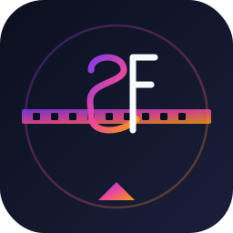
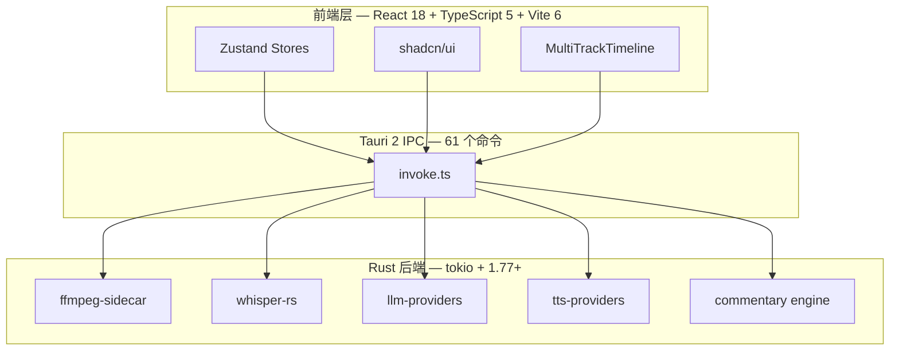

<!--
SPDX-License-Identifier: MIT
-->

# StoryFab 

> 🎬 开源 AI 影视解说创作工坊 · 本地优先 · 隐私安全 · 全链路自动化

[](LICENSE)
[](https://tauri.app/)
[](https://react.dev/)
[](https://www.typescriptlang.org/)
[](https://www.rust-lang.org/)
[](CHANGELOG.md)
[](https://github.com/Agions/story-fab/actions)
[](https://github.com/Agions/story-fab/actions)
[](CONTRIBUTING.md)

[📖 在线文档](https://agions.github.io/story-fab/) · [🔄 更新日志](CHANGELOG.md)

---

## 📋 项目概览

| 指标 | 数值 |
|------|------|
| **前端组件** | 41+ 组件目录 |
| **Tauri 命令** | 61 个 IPC 命令 |
| **业务服务** | 13 个模块 |
| **Rust 代码** | 27,000+ 行 |
| **测试覆盖** | 98%+ |
| **构建产物** | 1.3MB |
| **支持平台** | Windows / macOS / Linux |

---

## ✨ 为什么选择 StoryFab？

StoryFab 是一款革命性的桌面视频创作工具，将 **AI 智能分析**、**自动化解说生成** 和 **本地化处理** 完美结合。无论是直播回放、电影解说还是短视频创作，StoryFab 都能帮助您高效完成。

### 🎯 核心优势

| 特性 | 传统方案 | StoryFab |
|------|----------|----------|
| **隐私保护** | 视频上传云端 | ✅ 100% 本地处理 |
| **AI 解说** | 手动编写脚本 | ✅ 5步Agent Pipeline自动生成 |
| **字幕生成** | 在线转写服务 | ✅ 本地Whisper离线转写 |
| **配音合成** | 付费配音员 | ✅ Edge TTS + Azure TTS多种音色 |
| **工作流** | 多软件切换 | ✅ 一站式完成全链路 |
| **成本** | 订阅制收费 | ✅ 完全开源免费 |

---

## 🚀 快速开始

### 📦 下载安装

支持 Windows、macOS、Linux 三大平台，选择对应架构下载即可：

| 平台 | 架构 | 下载链接 |
|------|------|----------|
| **Windows** | x64 | [下载安装包](https://github.com/Agions/story-fab/releases) |
| **macOS** | Apple Silicon | [下载DMG](https://github.com/Agions/story-fab/releases) |
| **macOS** | Intel | [下载DMG](https://github.com/Agions/story-fab/releases) |
| **Linux** | x64 | [下载AppImage](https://github.com/Agions/story-fab/releases) |

> 💡 **首次启动**会自动下载 FFmpeg 和 Whisper 二进制，请确保网络连接正常。

### 🔨 从源码构建

适合开发者自定义功能或参与贡献：

```bash
# 1️⃣ 克隆仓库
git clone https://github.com/Agions/story-fab.git
cd story-fab

# 2️⃣ 安装依赖
npm install

# 3️⃣ 启动开发模式（热重载）
npm run tauri -- dev

# 4️⃣ 生产构建
npm run tauri -- build
```

**前置要求：**
- Node.js ≥ 18
- npm / pnpm
- Rust ≥ 1.77 ([安装指南](https://www.rust-lang.org/tools/install))
- FFmpeg

---

## 🎬 工作模式

StoryFab 提供两种专业工作流，满足不同创作场景：

### 📝 剪辑模式
**适用场景**：直播回放、会议记录、游戏集锦、教学视频

**核心能力：**
- 🤖 AI 自动识别高光时刻
- ✂️ 智能切片和剪辑
- 📐 多比例导出（9:16 / 1:1 / 16:9 / 4:5 / 21:9）
- 🎞️ 硬字幕烧录 + 软字幕双轨

**典型工作流：**
```
导入视频 → AI高光检测 → 手动微调 → 选择比例 → 导出成片
```

### 🎭 解说模式
**适用场景**：短剧解说、电影影评、综艺节目、游戏剧情

**核心能力：**
- 🧠 **Director Agent** - 多轮对话式节奏策划
- 📝 **Visual Agent** - 智能分镜设计
- ✍️ **Narration Agent** - 自动生成解说文案
- ⏱️ **Timing Agent** - 精准控制节奏和停顿
- 🎤 **TTS 配音** - Edge TTS / Azure TTS 合成
- 🎬 一键生成完整解说视频

**典型工作流：**
```
导入视频 → Director策划 → 5步Agent Pipeline → TTS配音 → 字幕烧录 → 导出
```

👉 [了解更多解说模式 →](docs/guide/commentary-mode.md)

---

## 🌟 核心特性

### 🤖 10+ 家 LLM 提供商
支持全球主流 AI 模型，灵活切换：
- **国际**：OpenAI (GPT-4o)、Anthropic (Claude 3.5)、Google (Gemini)
- **国产**：Alibaba (Qwen)、ZhipuAI (GLM)、iFlytek (Spark)、DeepSeek、Moonshot (Kimi)
- **本地**：Ollama 本地部署 + Custom API 自定义接入

### 🗣️ 专业 TTS 配音
- **Edge TTS**：微软 Edge 免费引擎，几十种音色
- **Azure TTS**：企业级语音服务，高质量输出

### 🎙️ 本地 Whisper 转写
- 基于 `faster-whisper` 的离线字幕生成
- 6 档模型可选（tiny / base / small / medium / large-v2 / large-v3）
- 完全离线运行，视频不上传云端

### ⚡ GPU 加速渲染
- FFmpeg NVENC（NVIDIA）/ VideoToolbox（macOS）硬件编码
- 硬字幕烧录 + 软字幕多语言轨道
- 支持自定义分辨率、码率、格式

### 🔒 隐私至上
- 所有视频处理在本地完成
- 原始素材、字幕、脚本永不上传
- 离线也可使用核心功能（TTS 需联网）

---

## 🏗️ 技术架构



📊 **项目规模：**
- 📁 41+ 前端组件目录
- 🔧 61 个 Tauri IPC 命令
- 🧠 13 个业务服务模块
- 📝 27,000+ 行 Rust 代码

👉 [深入架构 →](docs/dev/architecture.md)

---

## 📚 文档导航

### 🎓 用户指南

- [安装指南](docs/guide/installation.md) - 下载、安装、配置
- [快速开始](docs/guide/quick-start.md) - 5分钟上手
- [剪辑模式](docs/guide/commentary-mode.md) - AI高光检测与导出
- [解说模式](docs/guide/ai-analysis.md) - Director Agent深度解析
- [脚本生成](docs/guide/script-generation.md) - AI文案创作
- [导出设置](docs/guide/export.md) - 多格式导出配置
- [高级配置](docs/guide/configuration.md) - LLM/TTS/Whisper配置
- [快捷键](docs/guide/keyboard-shortcuts.md) - 提升效率

### 🛠️ 开发者文档

- [系统架构](docs/dev/architecture.md) - 技术架构深度解析
- [项目结构](docs/dev/project-structure.md) - 代码组织说明
- [解说工作流](docs/dev/commentary.md) - 5步Pipeline实现细节
- [AI服务](docs/dev/ai-services.md) - LLM/TTS/Whisper集成
- [Tauri命令](docs/dev/tauri-commands.md) - IPC接口完整列表
- [构建发布](docs/dev/build-release.md) - CI/CD指南

### 📖 参考资料

- [配置参考](docs/reference/config.md) - 完整配置项说明
- [常见问题](docs/reference/faq.md) - 问题排查与解答

---

## 🛠️ 开发命令

```bash
# 前端开发
npm run dev                  # Vite开发服务器 (端口 1430)
npm run build                # 生产构建
npm run build:prod           # 生产构建 (详细输出)
npm run test                 # 运行测试

# Tauri桌面应用
npm run tauri -- dev         # 启动桌面应用
npm run tauri -- build       # 构建桌面应用

# 文档站
npm run docs:dev            # VitePress开发模式
npm run docs:build          # 构建静态文档
npm run docs:preview        # 预览文档

# 代码质量
npm run lint                # ESLint检查
npm run lint:fix            # ESLint自动修复
npm run format              # Prettier格式化
npm run type-check          # TypeScript类型检查
```

---

## 🤝 贡献指南

我们欢迎所有形式的贡献！无论是新功能、Bug修复、文档改进还是问题反馈。

### 📋 贡献流程

1. **Fork 本仓库**
2. **创建特性分支** (`git checkout -b feature/AmazingFeature`)
3. **提交更改** (`git commit -m 'feat: add amazing feature'`)
4. **推送到分支** (`git push origin feature/AmazingFeature`)
5. **开启 Pull Request**

### 📝 提交规范

我们遵循 [Conventional Commits](https://www.conventional-commits.org/) 规范：

- `feat:` ✨ 新功能
- `fix:` 🐛 Bug修复
- `docs:` 📝 文档更新
- `refactor:` ♻️ 代码重构
- `perf:` ⚡ 性能优化
- `test:` ✅ 测试相关
- `chore:` 🔧 构建/工具链
- `style:` 💄 代码格式

### 🔌 新增 LLM / TTS Provider？

参考 [AI服务开发指南](docs/dev/ai-services.md)，在 `src/core/services/providers/` 下实现对应 trait 即可。

## 📜 行为准则

本项目遵循 [Contributor Covenant](https://www.contributor-covenant.org/) 行为准则。
请保持尊重、包容的交流态度。

## 🔒 安全策略

发现安全漏洞？请发送邮件至 `agions@qq.com`，而非公开 Issue。
我们会在 48 小时内响应。

---

## 🗺️ 路线图

- [x] v2.0 - Tauri 2 迁移 + 解说模式重构
- [x] v2.1 - 新增 4 家国产 LLM 提供商
- [x] v2.2 - Director Agent 多轮对话优化
- [ ] v2.3 - 多轨道时间线编辑器
- [ ] v2.4 - 插件系统 + 自定义工作流
- [ ] v2.5 - 团队协作功能（可选云端同步）

---

## 📄 许可证

本项目基于 [MIT](LICENSE) 协议开源。

---

## 🙏 致谢

感谢所有贡献者和支持者！

- [Tauri](https://tauri.app/) - 跨平台桌面应用框架
- [FFmpeg](https://ffmpeg.org/) - 音视频处理
- [faster-whisper](https://github.com/SYSTRAN/faster-whisper) - 离线语音识别
- [React](https://react.dev/) + [Vite](https://vitejs.dev/) - 前端框架

---

<div align="center">

**Star ⭐ 如果 StoryFab 对你有帮助！**

[GitHub](https://github.com/Agions/story-fab) · [文档](https://agions.github.io/story-fab/) · [问题反馈](https://github.com/Agions/story-fab/issues)

</div>
