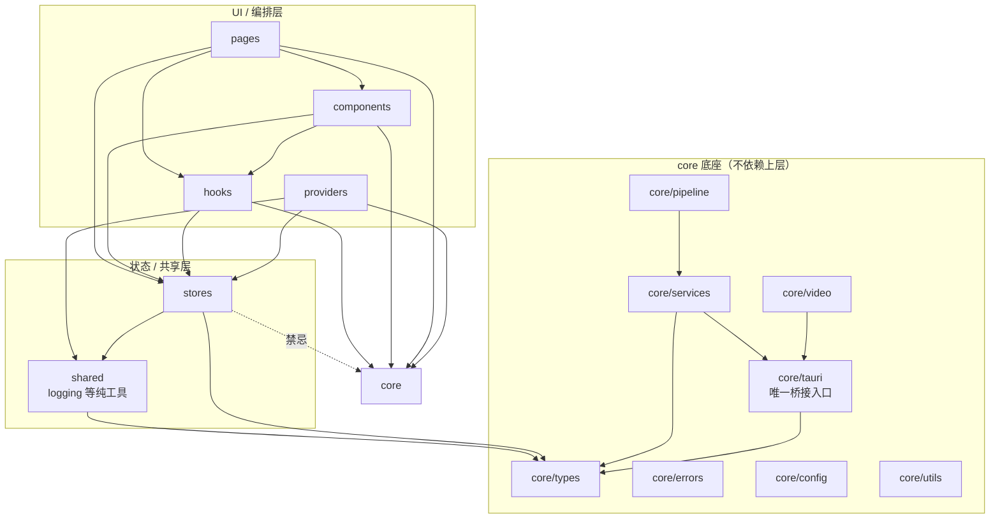
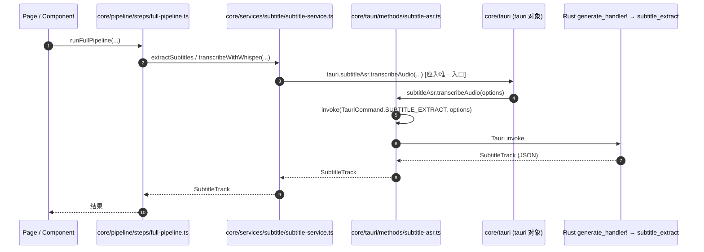

# StoryFab 架构概览（Architecture）

> Tauri 2 + Rust 桌面应用。前端 React 18 + TypeScript（约 430 文件）；后端 Rust（约 94 个 `.rs`）。
> 本文描述模块依赖、Rust 命令注册结构、关键调用链，并标注已知架构坏味。
> 命名规范见 `docs/NAMING_AND_MODULARIZATION.md`。

---

## 1. 前端模块依赖图

分层（依赖方向单向向下：`core` 不被上层反向依赖）：



要点：

- `core` 是所有上层的基础；按约定 `core` 不得 `import` 来自 `stores` / `components` / `pages` 的模块（图中以“禁忌”虚线标注，重构期需消除任何实际反向引用）。
- `shared` 只承载跨层纯工具（如 `logging`），不依赖具体业务。
- `stores` 是 Zustand 状态层，被 `hooks` / `components` / `pages` / `providers` 消费。

---

## 2. Rust 命令注册结构

`lib.rs` 是命令注册中枢：声明模块、用 `pub use` 把叶子命令函数上提，最后由 `generate_handler!` 一次性注册到 Tauri。

```mermaid
graph TD
    lib[lib.rs<br/>generate_handler! 中枢] --> mod[commands/mod.rs<br/>pub mod ai; pub mod project; ...]
    mod --> domain[commands/&lt;domain&gt;/mod.rs<br/>pub use 上提 handler]
    domain --> file[commands/&lt;domain&gt;/&lt;file&gt;.rs<br/>#[tauri::command] fn]

    lib -. pub use .-> domain
    lib --> generate[invoke_handler!<br/>generate_handler![...]]
```

机制：

- `commands/mod.rs` 用 `pub mod` 声明各业务域（`ai` / `auto_save` / `commentary` / `export_state` / `ffprobe` / `file_ops` / `llm` / `project` / `render` / `crash_recovery`）。
- 每个 `commands/<domain>/mod.rs` 用 `pub use` 把该域下的 handler 函数上提，使 `lib.rs` 能直接 `pub use commands::ai::{detect_highlights, ...}`。
- `lib.rs` 的 `generate_handler![run_ai_director_plan, save_project_file, ...]` 是真正的注册中枢，列出的函数名（`snake_case`）即前端通过 `TauriCommand` 调用的命令名。

> 前端命令名与 Rust 注册名通过 `src/core/tauri/invoke.ts` 的 `TauriCommand` 常量表对齐，二者必须保持一致。

---

## 3. 关键调用链：字幕提取（Subtitle Extraction）

以“全流水线提取字幕”为例，展示前端 → 桥接 → Rust 的完整链路。



链路分层：

1. **编排层**：`src/core/pipeline/steps/full-pipeline.ts` 驱动流水线步骤。
2. **服务层**：`src/core/services/subtitle/subtitle-service.ts` 负责字幕业务（格式、翻译、质量分级）。
3. **桥接层（应为唯一入口）**：`src/core/tauri/methods/subtitle-asr.ts` 的 `subtitleAsr.transcribeAudio` → `invoke(TauriCommand.SUBTITLE_EXTRACT, options)`。
4. **Rust 端**：`generate_handler!` 注册的 `subtitle_extract` handler 执行实际提取/转录。

> ⚠️ 当前 `subtitle-service.ts` 存在**双调用路径**（见 §4）：翻译走 `invoke(TauriCommand.TRANSLATE_TEXT, ...)` 裸调用，烧录字幕走 `import('@tauri-apps/api/core').invoke('export_video', ...)` 裸字符串命令名——均绕过 `tauri` 对象与常量表。目标调用链如上图（第 3 步统一经由 `tauri` 对象）。

---

## 4. 已知架构坏味（Architecture Smells）

| # | 坏味 | 现象 | 影响 | 建议 |
|---|------|------|------|------|
| S1 | **双调用路径** | 业务代码散落裸 `invoke()` / 裸字符串命令名，绕过 `core/tauri` 的 `tauri` 对象与 `TauriCommand` 常量表 | 命令名拼写无编译期校验、无统一重试/错误封装、前后端改名易漏 | 全部收敛到 `import { tauri } from '@/core/tauri'`；现状散落点：`src/core/services/subtitle/subtitle-service.ts`、`src/core/services/export/export-service.ts`、`src/core/video/tauri-video-processor.ts` |
| S2 | **Store 体量过大** | `src/stores/editor-store.ts` ~390 行；`timeline-store.test.ts` ~551 行；`src/stores` 合计 ~1549 行集中少量文件 | 单 store 职责过宽、耦合高、难以测试与复用 | 按子域拆分（如 timeline / project / editor 子 slice），或下沉到 `core/services` |
| S3 | **Reducer 落点不一** | `.reducer.ts` / `.reducer.test.ts` 散落于 `core/types/storyfab/`、`components/*/`、`components/*/hooks/`、`hooks/`、`pages/workspace/*/` 等多处 | 命名风格不统一（点分角色后缀），难以定位与迁移 | 拍平为 kebab（`name-reducer.ts`）并按域归并；由 `scripts/check-naming.mjs` 的 `role-suffix-flatten` 类别持续追踪 |
| S4 | **PascalCase 目录** | 如 `src/pages/workspace/assemble/highlights/`（大写目录） | 违反目录 kebab 约定，跨平台（Git 大小写）易出问题 | 重命名为 `highlights/` 并同步引用 |

---

## 5. 重构阶段关联

- **阶段 0（本文档与命名脚本）**：补齐 `docs/NAMING_AND_MODULARIZATION.md`、`docs/ARCHITECTURE.md`，重写 `scripts/check-naming.mjs` 为真门禁（仅报告）。
- **后续阶段**：按命名清单（角色后缀拍平、目录 kebab、禁止目录重命名）与架构坏味（S1–S4）分批收敛，每批以 `node scripts/check-naming.mjs` 计数下降作为验收信号之一。
