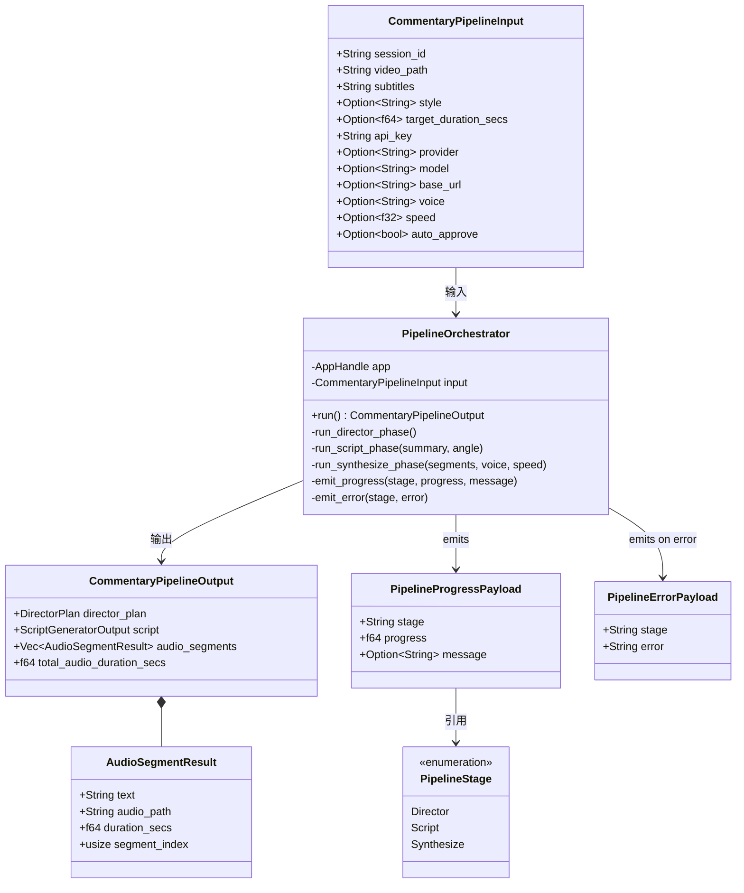

# O2 — Pipeline Orchestration 架构设计

> 作者：高见远 (Gao), Software Architect  
> 范围：StoryFab 桌面应用 Rust 后端（`src-tauri/src/`）  
> 性质：分析与设计交付物（ANALYSIS + DESIGN）。本文件不包含实现代码。

---

## Part A: System Design

### 1. Implementation Approach

#### 1.1 核心难点分析

| 难点 | 描述 |
|---|---|
| **状态机生命周期** | Director 状态机使用全局 `Lazy<Mutex<HashMap>>` 存储，pipeline 必须在适当节点调用 `create → start → generate → approve → destroy`，确保状态不泄漏 |
| **跨模块类型不兼容** | `ScriptStylePreset`（Director，PascalCase，`kebab-case` 序列化）与 `ScriptStyle`（Script Generator，PascalCase，`kebab-case` 序列化）语义相同但类型不同，需在 pipeline 层做映射 |
| **事件发射** | pipeline 需要向前端推送进度事件，必须持有 `AppHandle`（Tauri 事件系统要求）。现有 Director 命令**不使用** `AppHandle`（它们只操作全局 HashMap），因此 pipeline 需在 `#[tauri::command]` 层获取 `AppHandle` 并向下传递 |
| **批量 TTS 语义** | `synthesize_commentary_audio` 每次只合成一条，pipeline 需对 `script.segments` 逐段循环调用，并聚合结果 |
| **Additive-only 约束** | 不得改动任何现有 `#[tauri::command]` 函数签名，不得改动 `generate_handler!` 中现有条目的顺序 |

#### 1.2 框架与库选择

| 技术 | 选择 | 理由 |
|---|---|---|
| **Tauri 2.x 命令层** | 沿用现有 `#[tauri::command]` 宏 | 与现有 57 个命令保持同一模式，零学习成本 |
| **状态存储** | 沿用 `Lazy<Mutex<HashMap>>`（`director/states.rs`） | 与现有 Director 状态机完全一致，无需引入新依赖 |
| **事件系统** | Tauri `app.emit` + `AppHandle` | 与 `subtitle/transcribe.rs` 的 `whisper-progress` 事件模式一致 |
| **并发控制** | `tokio::spawn`（可选，P1 扩展） | 批量 TTS 初始版本用顺序循环（与现有 `synthesize_batch` 行为一致），P1 可切换为并发 |
| **错误处理** | 沿用 `Result<T, String>` | 不触碰命令契约；错误字符串通过 `pipeline-error` 事件传播 |

#### 1.3 架构模式

```
┌─────────────────────────────────────────────────────┐
│                    Frontend                          │
│  invoke('run_commentary_pipeline', input)            │
│  listen('pipeline-progress', ...)                    │
│  listen('pipeline-complete', ...)                    │
│  listen('pipeline-error', ...)                       │
└─────────────────────┬───────────────────────────────┘
                      │ Tauri IPC
                      ▼
┌─────────────────────────────────────────────────────┐
│  src-tauri/src/commands/commentary/pipeline/         │
│                                                     │
│  commands.rs                                        │
│  ┌──────────────────────────────────────────────┐   │
│  │ run_commentary_pipeline(app, input)           │   │
│  │  emit_progress(stage, pct, msg) via AppHandle │   │
│  │  ├── director_orchestrator::run_director_phase│   │
│  │  │     ├── create_director_session(...)       │   │
│  │  │     ├── start_director_analysis(...)       │   │
│  │  │     ├── generate_director_plan(...)        │   │
│  │  │     └── approve_director_plan(...)         │   │
│  │  ├── script_orchestrator::run_script_phase    │   │
│  │  │     └── generate_commentary_script(...)    │   │
│  │  └── synthesize_orchestrator::run_synthesize  │   │
│  │        └── CommentarySynthesizer::synthesize() │   │
│  │            (逐段循环)                          │   │
│  └──────────────────────────────────────────────┘   │
│                                                     │
│  types.rs         — 输入/输出/事件 DTO               │
│  director.rs      — Director 阶段编排（直接调用）    │
│  script.rs        — Script 阶段编排（直接调用）      │
│  synthesize.rs    — Synthesize 阶段编排（直接调用）  │
└─────────────────────────────────────────────────────┘
```

**关键设计决策：直接函数调用 vs Tauri invoke**

`run_commentary_pipeline` 作为 `#[tauri::command]` 注册在 `lib.rs` 中，内部**直接调用** Director / Script / Synthesizer 的现有函数（不走 `tauri::invoke` 层）。

理由：
- 三个现有命令函数（`create_director_session`、`generate_director_script`、`synthesize_commentary_audio`）均为普通 `pub fn` / `pub async fn`，可直接调用
- 直接调用避免了 Tauri IPC 序列化/反序列化开销
- Director 状态机通过全局 `Lazy<Mutex<HashMap>>` 共享，直接调用保证状态一致性
- 三个现有命令的 `#[tauri::command]` 签名完全不变

---

### 2. File List

#### 新建文件

```
src-tauri/src/commands/commentary/pipeline/mod.rs       # 子模块声明 + 导出
src-tauri/src/commands/commentary/pipeline/types.rs      # Pipeline 输入/输出/事件 DTO
src-tauri/src/commands/commentary/pipeline/commands.rs   # run_commentary_pipeline #[tauri::command]
src-tauri/src/commands/commentary/pipeline/director.rs   # Director 阶段编排（直接调用现有函数）
src-tauri/src/commands/commentary/pipeline/script.rs     # Script 阶段编排（直接调用现有函数）
src-tauri/src/commands/commentary/pipeline/synthesize.rs # Synthesize 阶段编排（直接调用现有函数）
```

#### 修改文件

```
src-tauri/src/commands/commentary/mod.rs                # 新增 `pub mod pipeline;` + pipeline 项 re-export
src-tauri/src/lib.rs                                    # 在 generate_handler! 中新增 `commentary::pipeline::commands::run_commentary_pipeline`
```

---

### 3. Data Structures and Interfaces

> 完整 Mermaid class diagram 见 `docs/class-diagram.mermaid`

```rust
// === types.rs ===

use serde::{Deserialize, Serialize};

/// Pipeline 阶段枚举（用于 progress 事件）
#[derive(Debug, Clone, Copy, PartialEq, Eq, Serialize, Deserialize)]
#[serde(rename_all = "snake_case")]
pub enum PipelineStage {
    Director,
    Script,
    Synthesize,
}

impl std::fmt::Display for PipelineStage {
    fn fmt(&self, f: &mut std::fmt::Formatter<'_>) -> std::fmt::Result {
        match self {
            PipelineStage::Director => write!(f, "director"),
            PipelineStage::Script => write!(f, "script"),
            PipelineStage::Synthesize => write!(f, "synthesize"),
        }
    }
}

/// Pipeline 输入（前端传入）
#[derive(Debug, Clone, Deserialize)]
#[serde(rename_all = "camelCase")]
pub struct CommentaryPipelineInput {
    pub session_id: String,
    pub video_path: String,
    pub subtitles: String,
    pub style: Option<String>,              // kebab-case: "conversational" 等
    pub target_duration_secs: Option<f64>,
    pub api_key: String,
    pub provider: Option<String>,
    pub model: Option<String>,
    pub base_url: Option<String>,
    pub voice: Option<String>,
    pub speed: Option<f32>,
    pub auto_approve: Option<bool>,         // P1: true 时跳过人工确认
}

/// Pipeline 输出（前端通过 pipeline-complete 事件接收）
#[derive(Debug, Clone, Serialize)]
#[serde(rename_all = "camelCase")]
pub struct CommentaryPipelineOutput {
    pub director_plan: DirectorPlan,
    pub script: ScriptGeneratorOutput,
    pub audio_segments: Vec<AudioSegmentResult>,
    pub total_audio_duration_secs: f64,
}

/// 单条音频合成结果
#[derive(Debug, Clone, Serialize)]
#[serde(rename_all = "camelCase")]
pub struct AudioSegmentResult {
    pub text: String,
    pub audio_path: String,
    pub duration_secs: f64,
    pub segment_index: usize,
}

/// pipeline-error 事件 Payload
#[derive(Debug, Clone, Serialize)]
#[serde(rename_all = "camelCase")]
pub struct PipelineErrorPayload {
    pub stage: String,
    pub error: String,
}

/// pipeline-progress 事件 Payload
#[derive(Debug, Clone, Serialize)]
#[serde(rename_all = "camelCase")]
pub struct PipelineProgressPayload {
    pub stage: String,
    pub progress: f64,    // 0.0 ~ 1.0
    pub message: Option<String>,
}
```

**类型映射关系（pipeline 层）**：

| Director 层 | Script Generator 层 | Pipeline 处理 |
|---|---|---|
| `ScriptStylePreset` (PascalCase, kebab-case serde) | `ScriptStyle` (PascalCase, kebab-case serde) | `style_str`（`Option<String>` 传入）→ 双方均可接受 kebab-case 字符串 |
| `DirectorPlan` | — | 直接透传 |
| `ScriptGeneratorOutput` | — | 直接透传 |
| — | `ScriptSegment` | 映射为 `AudioSegmentResult` 的基础 |

**Mermaid class diagram**（见 `docs/class-diagram.mermaid`）：



---

### 4. Program Call Flow

完整 Mermaid sequence diagram 见 `docs/sequence-diagram.mermaid`。

以下为主要流程描述：

```
Frontend                    Tauri IPC               Backend Pipeline
   │                            │                         │
   │  invoke('run_commentary   │                         │
   │  _pipeline', input)       │                         │
   │──────────────────────────>│                         │
   │                            │  run_commentary_       │
   │                            │  pipeline(app, input)  │
   │                            │ ─────────────────────> │
   │                            │                         │
   │                            │  emit_progress(         │
   │  pipeline-progress {       │    "director", 0.0)    │
   │    stage:"director"        │ <───────────────────── │
   │  } <───────────────────────│                         │
   │                            │                         │
   │                            │  [Director Phase]       │
   │                            │  create_director_       │
   │                            │  session(session_id,    │
   │                            │   style_opt)            │
   │                            │  start_director_        │
   │                            │  analysis(session_id,   │
   │                            │   video_path,           │
   │  pipeline-progress {       │   subtitles, ...)       │
   │    stage:"director",       │  generate_director_     │
   │    progress:0.2            │  plan(session_id, ...)  │
   │  } <───────────────────────│  approve_director_      │
   │                            │  plan(session_id)       │
   │                            │                         │
   │  pipeline-progress {       │                         │
   │    stage:"script",         │                         │
   │    progress:0.4            │                         │
   │  } <───────────────────────│                         │
   │                            │                         │
   │                            │  [Script Phase]         │
   │                            │  generate_commentary_   │
   │                            │  script(ScriptGenInput) │
   │                            │                         │
   │  pipeline-progress {       │                         │
   │    stage:"synthesize",     │                         │
   │    progress:0.6            │                         │
   │  } <───────────────────────│                         │
   │                            │                         │
   │                            │  [Synthesize Phase]     │
   │                            │  for each segment:      │
   │                            │    synthesize_commentary│
   │                            │    _audio(text, voice,  │
   │                            │    speed, "mp3", None)  │
   │                            │  ... (N 次循环)         │
   │                            │                         │
   │                            │  emit_progress(         │
   │  pipeline-progress {       │    "synthesize", 1.0)   │
   │    stage:"synthesize",     │ <───────────────────── │
   │    progress:1.0            │                         │
   │  } <───────────────────────│                         │
   │                            │                         │
   │                            │  return Ok(output)      │
   │                            │ <───────────────────── │
   │  pipeline-complete {       │                         │
   │    director_plan: {...},   │                         │
   │    script: {...},          │                         │
   │    audio_segments: [...]   │                         │
   │  } <───────────────────────│                         │
   │                            │                         │
```

**错误分支**：

```
   │                            │  [Script Phase 失败]
   │                            │  generate_commentary_script(...) → Err(e)
   │                            │
   │                            │  emit_error("script", e)
   │                            │ <───────────────────── │
   │  pipeline-error {          │
   │    stage:"script",         │
   │    error:"..."             │
   │  } <───────────────────────│
   │                            │
   │                            │  [可选] 回滚 Director 状态
   │                            │  destroy_director_session(session_id)
   │                            │
   │                            │  return Err(e)
   │                            │ <───────────────────── │
```

---

### 5. Anything UNCLEAR

以下为设计过程中识别的不确定点，均已基于代码审计做出合理假设：

| # | 不确定点 | 假设 | 如需澄清请告知 |
|---|---|---|---|
| 1 | `start_director_analysis` 内部仅更新状态，不做实际分析 | Pipeline 沿用此行为；若未来实现真正的分析逻辑，pipeline 无需改动 | 是 |
| 2 | Director 的 `analysis` 字段当前为 `None`（除非前端通过其他路径填充） | `build_plan` 会优雅降级（使用默认摘要），pipeline 沿用此降级行为 | 是 |
| 3 | 批量 TTS 是否使用 `CommentarySynthesizer::synthesize_batch` | **不使用**——`synthesize_batch` 内部也是顺序循环，且不便于中间报告进度。Pipeline 自行逐段循环，每段完成即 emit 进度 | 否 |
| 4 | `auto_approve` 参数（P1）是否在 P0 实现 | **P0 不实现**——P0 pipeline 始终自动 approve（无人工确认逻辑），`auto_approve` 字段保留在 input 中但暂不使用 | 否 |
| 5 | Pipeline 完成后 Director 会话是否自动销毁 | **不自动销毁**——保留会话供前端查询 `get_director_status`；前端可在收到 `pipeline-complete` 后自行调用 `destroy_director_session` | 是 |
| 6 | `run_commentary_pipeline` 命令签名中是否需要 `AppHandle` | **需要**——Tauri 2.x 中通过 `app: tauri::AppHandle` 参数注入，与 `subtitle/transcribe.rs` 模式一致 | 否 |

---

## Part B: Task Decomposition

### 6. Required Packages

无新增第三方依赖。全部使用项目已有的：

```
- tauri@2.x (框架内置，用于 AppHandle / emit)
- serde@1 (已有，用于 DTO 序列化)
- tokio@1 (已有，异步运行时)
- tracing (已有，日志)
- once_cell (已有，Lazy 状态存储)
```

---

### 7. Task List

```
T01: 项目基础设施（Pipeline 模块骨架 + 类型定义 + mod.rs 导出 + lib.rs 注册）
T02: 实现 Director 阶段编排（director.rs + director 阶段测试逻辑）
T03: 实现 Script 阶段编排（script.rs + 类型映射）
T04: 实现 Synthesize 阶段编排（synthesize.rs + 批量循环）
T05: 实现主命令函数 + 事件发射 + 错误聚合（commands.rs）
```

#### T01: 项目基础设施

- **Task ID**: T01
- **Task Name**: 创建 pipeline 模块骨架（类型定义 + mod.rs + lib.rs 注册）
- **Source Files**:
  - **新建**: `src-tauri/src/commands/commentary/pipeline/mod.rs`
  - **新建**: `src-tauri/src/commands/commentary/pipeline/types.rs`
  - **修改**: `src-tauri/src/commands/commentary/mod.rs`
  - **修改**: `src-tauri/src/lib.rs`
- **Dependencies**: 无
- **Priority**: P0

**内容说明**：
- `pipeline/mod.rs`：`pub mod director; pub mod script; pub mod synthesize; pub mod types; pub mod commands;` + re-export `run_commentary_pipeline`、`CommentaryPipelineInput/Output`、`PipelineStage`
- `pipeline/types.rs`：定义 `PipelineStage`、`CommentaryPipelineInput`、`CommentaryPipelineOutput`、`AudioSegmentResult`、`PipelineProgressPayload`、`PipelineErrorPayload`
- `commands/commentary/mod.rs`：新增 `pub mod pipeline;`，在 re-export 区添加 pipeline 项的导出
- `lib.rs`：在 `generate_handler!` 列表末尾追加 `commentary::pipeline::commands::run_commentary_pipeline`

---

#### T02: 实现 Director 阶段编排

- **Task ID**: T02
- **Task Name**: 实现 Director 阶段编排函数
- **Source Files**:
  - **新建**: `src-tauri/src/commands/commentary/pipeline/director.rs`
  - **修改**: `src-tauri/src/commands/commentary/pipeline/types.rs`（如需要补充类型）
- **Dependencies**: T01
- **Priority**: P0

**内容说明**：
- `director.rs` 实现 `run_director_phase` 函数：
  ```rust
  pub async fn run_director_phase(
      app: &tauri::AppHandle,
      input: &CommentaryPipelineInput,
  ) -> Result<crate::commands::commentary::director::types::DirectorPlan, String>
  ```
- 内部按序调用（直接函数调用，非 Tauri invoke）：
  1. `create_director_session(session_id.clone(), style_opt)` — 创建会话
  2. `start_director_analysis(session_id.clone(), video_path, subtitles, target_duration)` — 启动分析
  3. `generate_director_plan(session_id.clone(), style_opt, target_duration)` — 生成 Plan
  4. `approve_director_plan(session_id.clone())` — 自动确认（P0 无人工确认）
- 每个步骤前后 emit `pipeline-progress` 事件（`stage: "director"`，progress 0.0→0.4→0.6→1.0）
- 任一阶段失败：emit `pipeline-error`（`stage: "director"`），调用 `destroy_director_session` 清理，返回 `Err`
- 成功时返回 `DirectorPlan`

---

#### T03: 实现 Script 阶段编排

- **Task ID**: T03
- **Task Name**: 实现 Script 阶段编排函数
- **Source Files**:
  - **新建**: `src-tauri/src/commands/commentary/pipeline/script.rs`
- **Dependencies**: T02
- **Priority**: P0

**内容说明**：
- `script.rs` 实现 `run_script_phase` 函数：
  ```rust
  pub async fn run_script_phase(
      app: &tauri::AppHandle,
      director_plan: &DirectorPlan,
      input: &CommentaryPipelineInput,
  ) -> Result<ScriptGeneratorOutput, String>
  ```
- 从 `director_plan.summary` 和 `director_plan.angle` 提取摘要和角度，传入 script generator
- 构建 `ScriptGeneratorInput`：
  - `subtitles`: 来自 `input.subtitles`
  - `style`: 将 `input.style`（kebab-case string）映射为 `ScriptStyle` 枚举
  - `target_duration_secs`: 来自 `input.target_duration_secs`
  - `summary`: 来自 `director_plan.summary`
  - `angle`: 来自 `director_plan.angle`
  - `highlights`: 来自 `director_plan.key_points`
  - `provider` / `model` / `api_key` / `base_url`: 来自 `input`
- 调用 `generate_commentary_script(script_input)` 直接调用
- emit `pipeline-progress`（`stage: "script"`，progress 0.0→1.0）
- 失败时 emit `pipeline-error`（`stage: "script"`），返回 `Err`

---

#### T04: 实现 Synthesize 阶段编排

- **Task ID**: T04
- **Task Name**: 实现 Synthesize 阶段编排函数（逐段批量 TTS）
- **Source Files**:
  - **新建**: `src-tauri/src/commands/commentary/pipeline/synthesize.rs`
- **Dependencies**: T03
- **Priority**: P0

**内容说明**：
- `synthesize.rs` 实现 `run_synthesize_phase` 函数：
  ```rust
  pub async fn run_synthesize_phase(
      app: &tauri::AppHandle,
      script_output: &ScriptGeneratorOutput,
      voice: &str,
      speed: f32,
  ) -> Result<Vec<AudioSegmentResult>, String>
  ```
- 对 `script_output.segments` 逐段调用：
  ```rust
  synthesize_commentary_audio(
      segment.text.clone(),
      voice.to_string(),
      speed,
      Some("mp3".to_string()),
      None, // 使用 edge-tts 默认临时路径
  ).await
  ```
- 每完成 N/M 段时 emit `pipeline-progress`（`stage: "synthesize"`，progress = N/M）
- 逐段构建 `AudioSegmentResult`（含 `segment_index`）
- 单段失败：记录错误，继续后续段（lenient 模式）；最终通过 `pipeline-error` 报告汇总错误
- P1 可改为 `tokio::spawn` 并发合成 + `ResourceLimiter` 限流

---

#### T05: 实现主命令函数 + 事件发射 + 错误聚合

- **Task ID**: T05
- **Task Name**: 实现 `run_commentary_pipeline` 主命令（事件发射 + 三阶段串联 + 输出聚合）
- **Source Files**:
  - **新建**: `src-tauri/src/commands/commentary/pipeline/commands.rs`
  - **修改**: `src-tauri/src/commands/commentary/pipeline/types.rs`（如需要补充 `emit_progress` / `emit_error` 辅助函数所在文件）
- **Dependencies**: T01, T02, T03, T04
- **Priority**: P0

**内容说明**：
- `commands.rs` 实现：
  ```rust
  #[tauri::command]
  pub async fn run_commentary_pipeline(
      app: tauri::AppHandle,
      input: CommentaryPipelineInput,
  ) -> Result<CommentaryPipelineOutput, String>
  ```
- 内部调用顺序：
  1. `emit_progress(app, PipelineStage::Director, 0.0, Some("开始 Director 阶段".into()))`
  2. `let director_plan = run_director_phase(&app, &input).await?`
  3. `emit_progress(app, PipelineStage::Script, 0.0, ...)`
  4. `let script_output = run_script_phase(&app, &director_plan, &input).await?`
  5. `emit_progress(app, PipelineStage::Synthesize, 0.0, ...)`
  6. `let audio_segments = run_synthesize_phase(&app, &script_output, voice, speed).await?`
  7. 聚合 `total_audio_duration_secs`
  8. `emit_progress(app, PipelineStage::Synthesize, 1.0, ...)`
  9. `app.emit("pipeline-complete", output)` → 返回 `Ok(output)`
- 错误处理：任一阶段 `Err` → `emit_error` → 返回 `Err`（不吞错）
- 辅助函数：
  - `emit_progress(app, stage, progress, message)` — 内部调用 `app.emit("pipeline-progress", payload)`
  - `emit_error(app, stage, error)` — 内部调用 `app.emit("pipeline-error", payload)`
- 注意：`AppHandle` 在 `#[tauri::command]` 中由 Tauri 自动注入，与 `subtitle/transcribe.rs:46` 模式一致

---

### 8. Shared Knowledge

#### 8.1 事件命名约定

| 事件名 | 方向 | Payload 类型 | 触发时机 |
|---|---|---|---|
| `pipeline-progress` | Backend → Frontend | `PipelineProgressPayload` | 每个子阶段开始和结束时 |
| `pipeline-complete` | Backend → Frontend | `CommentaryPipelineOutput` | 三阶段全部成功完成时 |
| `pipeline-error` | Backend → Frontend | `PipelineErrorPayload` | 任一子阶段失败时 |

#### 8.2 事件 Payload 格式

```rust
// pipeline-progress
PipelineProgressPayload {
    stage: "director" | "script" | "synthesize",
    progress: 0.0_f64,   // 0.0 ~ 1.0 表示该阶段内部进度
    message: Some("正在生成解说 Plan..."), // 可选，中文描述
}

// pipeline-error
PipelineErrorPayload {
    stage: "director" | "script" | "synthesize",
    error: "LLM 调用失败: ...",  // 原始错误字符串
}

// pipeline-complete
CommentaryPipelineOutput { ... } // 见 types.rs 定义
```

#### 8.3 错误消息格式

- 所有错误以 `String` 返回，格式：`"[阶段] 描述：原因"`，如 `"[director] 创建会话失败：session_id 已存在"`
- `pipeline-error` 事件的 `error` 字段直接使用此字符串
- 不引入新的错误类型枚举（保持 `Result<T, String>` 契约不变）

#### 8.4 Director 状态机交互规范

- Pipeline **直接调用** `director::commands` 中的 8 个函数（`create/get/start/generate/approve/revise/complete/destroy`）
- Pipeline 调用顺序：`create → start → generate → approve`（固定顺序）
- Pipeline **不调用** `get_director_status`（前端可通过该命令查询状态）
- Pipeline 出错时调用 `destroy_director_session` 清理状态，避免泄漏
- Pipeline 不触碰 `DirectorStateMachine` 内部字段（全部通过公开函数操作）

#### 8.5 风格映射规范

```rust
// pipeline 层 style 映射（String → ScriptStylePreset / ScriptStyle）
fn parse_style_for_director(style: Option<&str>) -> ScriptStylePreset {
    match style.and_then(|s| match s {
        "humorous" => Some(ScriptStylePreset::Humorous),
        "serious" => Some(ScriptStylePreset::Serious),
        "conversational" => Some(ScriptStylePreset::Conversational),
        "suspense" => Some(ScriptStylePreset::Suspense),
        "warm" => Some(ScriptStylePreset::Warm),
        _ => None,
    }) {
        Some(s) => s,
        None => ScriptStylePreset::Conversational, // 默认值
    }
}

fn parse_style_for_script(style: Option<&str>) -> ScriptStyle {
    match style.and_then(|s| match s {
        "humorous" => Some(ScriptStyle::Humorous),
        "serious" => Some(ScriptStyle::Serious),
        "conversational" => Some(ScriptStyle::Conversational),
        "suspense" => Some(ScriptStyle::Suspense),
        "warm" => Some(ScriptStyle::Warm),
        _ => None,
    }) {
        Some(s) => s,
        None => ScriptStyle::Conversational,
    }
}
```

#### 8.6 新常量

```rust
// pipeline/types.rs 或 commands.rs
const PIPELINE_PROGRESS_EVENT: &str = "pipeline-progress";
const PIPELINE_COMPLETE_EVENT: &str = "pipeline-complete";
const PIPELINE_ERROR_EVENT: &str = "pipeline-error";
```

---

### 9. Open Questions / Decisions Needed

| # | 问题 | 建议 | 需决策方 |
|---|---|---|---|
| 1 | Pipeline 完成后 Director 会话是否自动销毁？ | 建议保留（前端可查询状态），由前端显式调用 `destroy_director_session` | PM / 前端 |
| 2 | `auto_approve` 参数在 P0 是否占位？ | 是，P0 始终自动 approve，字段保留在 input 定义中 | PM |
| 3 | 批量 TTS 错误策略：strict（失败即中止）还是 lenient（记录并继续）？ | P0 采用 lenient（与现有 `synthesize_batch` 行为一致），P1 提供 strict 模式 | PM |
| 4 | `start_director_analysis` 内部是否要填入真实的 `VideoAnalysisResult`？ | 当前为 no-op（仅更新状态），pipeline 沿用；如需实现分析逻辑，属于独立任务 | 产品 |
| 5 | Pipeline 事件是否需要带 `session_id` 字段？ | `PipelineProgressPayload` 当前不含 `session_id`（前端已知）；如需则补充 | 前端 |
