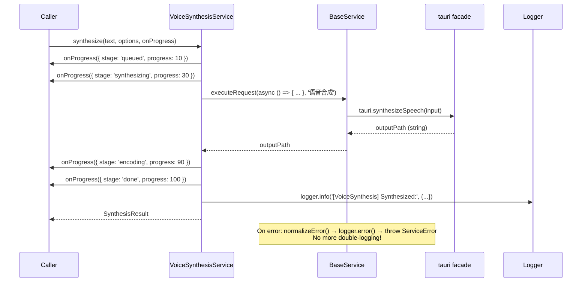
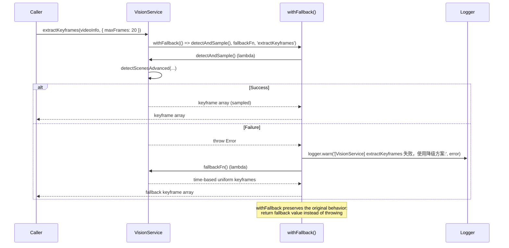
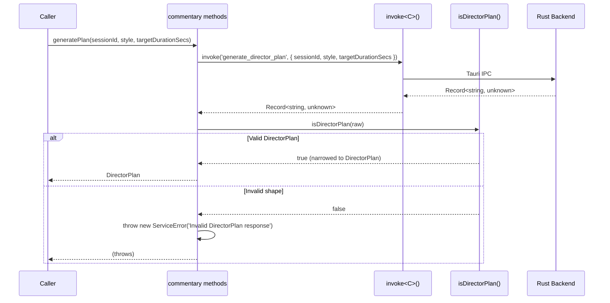
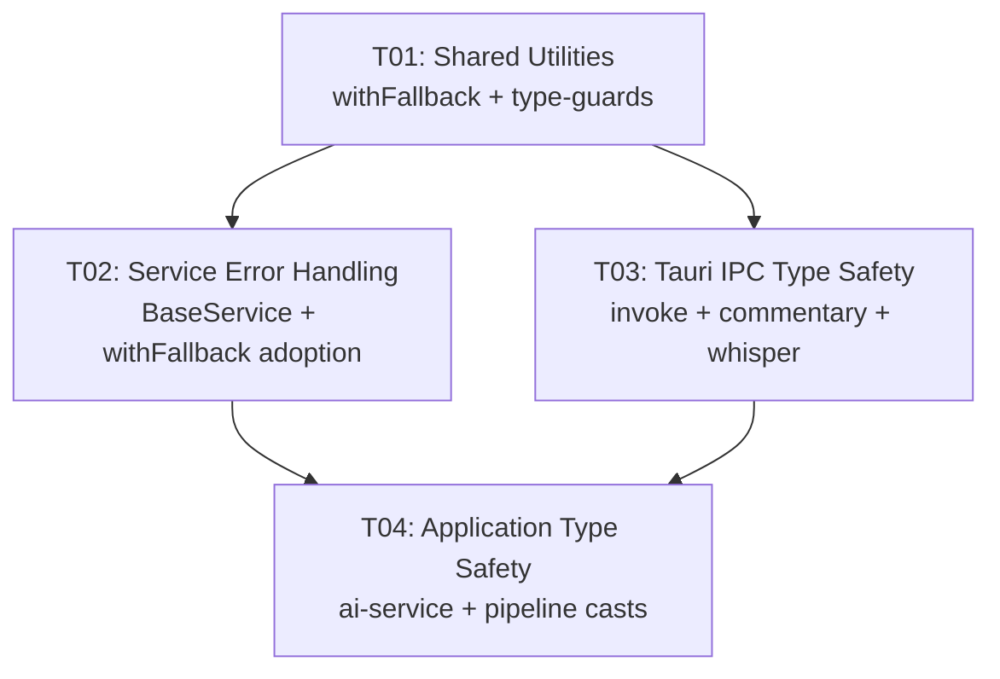

# StoryFab Architecture Quality Refactoring — System Design

> **Author**: Bob (Architect)  
> **Date**: 2026-07-10  
> **Scope**: Pure refactoring, zero behavior changes

---

## Part A: System Design

### 1. Implementation Approach

#### 1.1 Core Technical Challenges

| Challenge | Details |
|-----------|---------|
| **Heterogeneous error handling** | 5 services use ad-hoc try/catch; some log-then-throw (double-logging), some silently swallow, some return fallback objects |
| **Graceful degradation** | Services like VisionService and AudioVideoSyncService INTENTIONALLY return fallback values on error — this is correct behavior, not a bug. BaseService's `executeRequest()` always throws, which would break these |
| **`as unknown as` at Tauri IPC** | 15+ occurrences bypass TypeScript's type system. `command-types.ts` already defines correct input/output types — the casts are unnecessary in most cases, but a few `Record<string, unknown>` outputs genuinely need runtime guards |
| **Zero behavior change** | All error flows, fallback values, and observable behavior must remain identical |

#### 1.2 Framework & Pattern Selection

| Pattern | Where | Why |
|---------|-------|-----|
| **BaseService extension** | VoiceSynthesisService | Has `throw`-style error handling that maps directly to `executeRequest()` |
| **`withFallback()` utility** | AudioVideoSyncService, VisionService, ClipWorkflowService | Services that intentionally degrade — need to catch + log + return default without throwing |
| **Type guard functions** | Tauri IPC boundaries with `Record<string, unknown>` output | Runtime validation for Rust→TS data where command-types is generic |
| **Typed invoke wrapper** | `runCommentaryPipeline` in invoke.ts | Eliminate `as unknown as Record<string, unknown>` at call sites by using the existing generic `invoke<C>()` properly |
| **No change** | VideoEffectService | Pure synchronous config manipulation; no async/error paths to unify |

#### 1.3 Design Decisions

**Decision 1: `withFallback()` instead of extending BaseService for fallback services**

BaseService's `executeRequest()` **always throws**. Services like VisionService need to **return `[]` on error**. Adding a `suppressError` flag to `executeRequest` would pollute the base class. A standalone `withFallback()` helper is cleaner:

```typescript
// NEW: src/shared/utils/withFallback.ts
async function withFallback<T, F>(
  fn: () => Promise<T>,
  fallback: F,
  context?: string,
): Promise<T | F> { ... }
```

**Decision 2: Simple type guards, not zod**

For `DirectorPlan` (output of `generate_director_plan` / `revise_director_plan`), the command-types already define the shape as `Record<string, unknown>`. Adding zod would add a dependency for ~3 call sites. Simple predicate functions (`isDirectorPlan()`) are sufficient and zero-dependency.

**Decision 3: `command-types.ts` has the correct types — use them**

The existing `invoke<C>(command, args)` is already fully generic with `TauriCommandOutput<C>`. Most `as unknown as` casts exist because callers don't trust the generic or need to narrow `Record<string, unknown>`. The fix is:
- Use the typed invoke directly where output types are concrete
- Add type guards only where output is `Record<string, unknown>`

---

### 2. File List

```
src/
├── shared/utils/
│   ├── withFallback.ts          (NEW)  Graceful degradation helper
│   └── type-guards.ts           (NEW)  Shared type guard functions
│
├── core/
│   ├── tauri/
│   │   ├── invoke.ts            (MODIFY)  Fix runCommentaryPipeline cast
│   │   └── methods/
│   │       └── commentary.ts    (MODIFY)  Add type guards, remove casts
│   │
│   ├── services/
│   │   ├── ai/
│   │   │   ├── voice-synthesis-service.ts  (MODIFY)  Extend BaseService + fix casts
│   │   │   ├── ai-service.ts               (MODIFY)  Fix Scene property access pattern
│   │   │   └── vision/
│   │   │       └── index.ts                (MODIFY)  Adopt withFallback
│   │   │
│   │   ├── asr/
│   │   │   └── audio-sync-service.ts       (MODIFY)  Adopt withFallback
│   │   │
│   │   ├── subtitle/
│   │   │   └── whisper-service.ts          (MODIFY)  Type guard for WhisperResult
│   │   │
│   │   ├── commentary/
│   │   │   └── session-service.ts          (MODIFY)  Type guard for DirectorPlan
│   │   │
│   │   ├── video/
│   │   │   └── video-effect-service.ts     (NO CHANGE)
│   │   │
│   │   └── pipeline/
│   │       └── clip-pipeline/
│   │           ├── clip-workflow.ts         (MODIFY)  Adopt withFallback
│   │           └── pipeline.ts              (MODIFY)  Fix onProgress cast
│   │
│   └── pipeline/
│       └── steps/
│           └── commentary/
│               └── composite-pipeline.ts    (MODIFY)  Fix ChainPipeline casts
```

---

### 3. Data Structures and Interfaces

```mermaid
classDiagram
    %% ── Base Infrastructure ──
    class BaseService {
        <<abstract>>
        #name: string
        #config: RequestConfig
        +constructor(name: string, config: RequestConfig)
        #executeRequest~T~(requestFn: () => Promise~T~, context?: string): Promise~T~
        #retryRequest~T~(requestFn: () => Promise~T~, retries?: number, delayMs?: number, retryOn?: Function): Promise~T~
        #handleError(error: unknown, context?: string): never
        -normalizeError(error: unknown): ServiceError
    }

    class ServiceError {
        +message: string
        +code?: string
        +statusCode?: number
        +originalError?: Error
        +retryable?: boolean
    }

    %% ── New Utilities ──
    class WithFallback {
        <<function>>
        +withFallback~T,F~(fn: () => Promise~T~, fallback: F, context?: string): Promise~T | F~
    }

    class TypeGuards {
        <<function>>
        +isDirectorPlan(value: unknown): value is DirectorPlan
        +isDirectorStatusResponse(value: unknown): value is DirectorStatusResponse
        +isWhisperResult(value: unknown): value is WhisperResult
        +isTtsBackendArray(value: unknown): value is TtsBackend[]
        +isRecordOfStringUnknown(value: unknown): value is Record~string, unknown~
    }

    %% ── Services After Refactoring ──
    class VoiceSynthesisService {
        -config: VoiceConfig
        +getVoices(): VoiceItem[]
        +getChineseVoices(): VoiceItem[]
        +listBackends(): Promise~TtsBackend[]~
        +checkAvailable(): Promise~boolean~
        +preview(text: string): void
        +synthesize(text: string, options?, onProgress?): Promise~SynthesisResult~
        +synthesizeToBuffer(text: string, options?, onProgress?): Promise~object~
        +synthesizeAndSave(text: string, outputPath: string, options?, onProgress?): Promise~SynthesisResult~
        +getConfig(): VoiceConfig
        +updateConfig(config: Partial~VoiceConfig~): void
    }

    class AudioVideoSyncService {
        -config: SyncConfig
        +analyzeSync(videoPath: string, audioPath?: string): Promise~SyncResult~
        +autoSync(videoPath: string, audioPath?: string): Promise~SyncResult~
        +setOffset(offsetMs: number): void
        +getConfig(): SyncConfig
        +updateConfig(config: Partial~SyncConfig~): void
        +exportTimeline(segments: TimelineSegment[]): SyncTimeline
        -analyzeTimeline(videoPath: string): Promise~SyncTimeline~
        -fallbackSegments(videoPath: string): Promise~SyncTimeline~
        -detectIssues(timeline: SyncTimeline): Promise~SyncIssue[]~
    }

    class VisionService {
        +analyzeVideo(videoInfo: VideoInfo, options?): Promise~object~
        +detectScenesAdvanced(videoInfo: VideoInfo, options?): Promise~object~
        +extractKeyframes(videoInfo: VideoInfo, options?): Promise~Keyframe[]~
        +generateAnalysisReport(videoInfo, scenes, objects, emotions): Promise~VideoAnalysis~
        +detectHighlights(videoInfo: VideoInfo, options?): Promise~HighlightSegment[]~
        -optimizeScenes(scenes, objects, emotions): Scene[]
    }

    class ClipWorkflowService {
        -config: ClipConfig
        -_pipeline?: ClipRepurposingPipeline
        +processVideo(videoInfo, scriptSegments?): Promise~ClipResult~
        +processVideoWithPipeline(videoInfo, analysis?, pipelineOptions?, asrSegments?): Promise~ClipResult~
        +exportTimeline(segments: ClipSegment[]): object
        +getExportSettings(): ExportSettings
        +optimizeQuality(segments: ClipSegment[]): ClipSegment[]
        +getConfig(): ClipConfig
        +updateConfig(config: Partial~ClipConfig~): void
        -analyzeVideo(videoInfo: VideoInfo): Promise~VideoAnalysis~
        -generateClips(analysis, sceneChanges, silenceSections, scriptSegments?): ClipSegment[]
        -runASR(videoInfo: VideoInfo): Promise~ASRSegment[]~
    }

    class AIService {
        +generateText(model, prompt, settings): Promise~string~
        +generateScript(model, settings, params): Promise~ScriptData~
        +analyzeVideo(model, settings, videoInfo): Promise~Partial~VideoAnalysis~~
        +optimizeScript(model, settings, script, optimization): Promise~string~
        +translateScript(model, settings, script, targetLanguage): Promise~string~
        +getRecommendedModels(task): AIModel[]
        +getModelInfo(modelId): AIModel | null
        +getAllModels(): AIModel[]
        +getDomesticModels(): AIModel[]
        +cancelRequest(requestId: string): void
        -callAPI(model, settings, prompt): Promise~AIResponse~
    }

    class WhisperService {
        +transcribe(audioPath, modelSize?, language?, onProgress?): Promise~WhisperResult~
        +toSubtitleFormat(result: WhisperResult): object
    }

    %% ── Tauri Layer ──
    class TauriCommentaryMethods {
        +createSession(sessionId, style?): Promise~string~
        +getStatus(sessionId): Promise~DirectorStatusResponse~
        +generatePlan(sessionId, style?, targetDurationSecs?): Promise~DirectorPlan~
        +revisePlan(sessionId, modifications): Promise~DirectorPlan~
        +runCommentaryPipeline(input): Promise~CommentaryPipelineOutput~
    }

    class CommentarySessionService {
        <<function>>
        +createCommentarySession(sessionId, style?): Promise~string~
        +getCommentaryStatus(sessionId): Promise~DirectorStatusResponse~
        +destroyCommentarySession(sessionId): Promise~void~
        +startCommentaryAnalysis(sessionId, videoPath, subtitles, targetDurationSecs?): Promise~void~
        +generateCommentaryPlan(sessionId, style?, targetDurationSecs?): Promise~DirectorPlan~
        +approveCommentaryPlan(sessionId): Promise~string~
        +reviseCommentaryPlan(sessionId, modifications): Promise~DirectorPlan~
        +completeCommentaryRender(sessionId, outputPath): Promise~string~
    }

    %% ── Relationships ──
    BaseService <|-- VoiceSynthesisService : extends
    BaseService <|-- AIService : extends (existing)
    WithFallback ..> AudioVideoSyncService : uses
    WithFallback ..> VisionService : uses
    WithFallback ..> ClipWorkflowService : uses
    TypeGuards ..> TauriCommentaryMethods : uses (isDirectorPlan)
    TypeGuards ..> CommentarySessionService : uses (isDirectorPlan)
    TypeGuards ..> WhisperService : uses (isWhisperResult)
    TypeGuards ..> VoiceSynthesisService : uses (isTtsBackendArray)
```



---

### 4. Program Call Flow

#### 4.1 VoiceSynthesisService.synthesize() — After Refactoring



#### 4.2 VisionService.extractKeyframes() — withFallback Pattern



#### 4.3 Tauri commentary.generatePlan() — Type Guard Pattern



---

### 5. Anything UNCLEAR

| Item | Resolution |
|------|------------|
| `transcribe_audio` output type mismatch | `command-types.ts` says `SubtitleTrack`, but Rust actually returns `WhisperResult`-shaped data. Since this is refactoring (no behavior change), we add a type guard `isWhisperResult()` instead of fixing command-types. |
| `list_tts_backends` output type vs `TtsBackend` | command-types output has `{ id, name, label, description, requiresNetwork, requiresModelDownload, modelPath? }` — this is close to `TtsBackend` but `modelPath` is `string | undefined` vs `string | null`. Type guard handles the conversion. |
| `VideoEffectService` exclusion | Confirmed: it's 100% synchronous in-memory config manipulation. No async operations. No BaseService value. |
| `composite-pipeline.ts` Step type casts | The `ChainPipeline` constructor expects homogeneous `Step<I, O>` types but each step has different I/O. The casts are due to a generic constraint mismatch in the pipeline framework. Short-term: use `// SAFETY:` comments. Long-term: fix `ChainPipeline` generic signature (out of scope). |
| Test files with `as unknown as` | All test file occurrences are standard TypeScript test patterns (mock data, reducer action tests). **Not in scope** for this refactoring. |

---

## Part B: Task Decomposition

### 6. Required Packages

No new third-party packages needed. This is a pure refactoring.

```
# All dependencies already exist in the project
- typescript@^5.x (already present)
- @tauri-apps/api/core (already present)
```

---

### 7. Task List (ordered by dependency)

#### T01: Shared Utilities — withFallback helper + type guard functions

- **Task ID**: T01
- **Task Name**: Create shared withFallback utility and type guard functions
- **Source Files**:
  - `src/shared/utils/withFallback.ts` (NEW)
  - `src/shared/utils/type-guards.ts` (NEW)
- **Dependencies**: None
- **Priority**: P0

**Implementation details:**

**`src/shared/utils/withFallback.ts`**:
```typescript
import { logger } from '@/shared/utils/logging';

/**
 * Execute an async function with graceful degradation.
 * On error: logs a warning + returns the fallback value instead of throwing.
 *
 * Use when the caller INTENTIONALLY wants to continue with a default
 * value on failure (e.g., return empty array, return mock data).
 *
 * Contrast with BaseService.executeRequest() which always throws.
 */
export async function withFallback<T, F>(
  fn: () => Promise<T>,
  fallback: F,
  context?: string,
): Promise<T | F> {
  try {
    return await fn();
  } catch (error) {
    logger.warn(
      `[withFallback] ${context || '操作'} 失败，使用降级方案:`,
      error instanceof Error ? error.message : String(error),
    );
    return fallback;
  }
}
```

**`src/shared/utils/type-guards.ts`**:
```typescript
import type { DirectorPlan, DirectorStatusResponse } from '@/types';
import type { WhisperResult } from '@/core/services/subtitle/whisper-service';
import type { TtsBackend } from '@/core/services/ai/voice-synthesis-service';

/** Check if a value is a non-null object (not array) */
function isRecord(value: unknown): value is Record<string, unknown> {
  return typeof value === 'object' && value !== null && !Array.isArray(value);
}

/** Validate Rust Whisper response shape */
export function isWhisperResult(value: unknown): value is WhisperResult {
  if (!isRecord(value)) return false;
  if (typeof value.language !== 'string') return false;
  if (typeof value.duration_ms !== 'number') return false;
  if (!Array.isArray(value.segments)) return false;
  return value.segments.every(
    (s: unknown) =>
      isRecord(s) &&
      typeof s.start_ms === 'number' &&
      typeof s.end_ms === 'number' &&
      typeof s.text === 'string',
  );
}

/** Validate DirectorPlan from Rust IPC */
export function isDirectorPlan(value: unknown): value is DirectorPlan {
  if (!isRecord(value)) return false;
  // DirectorPlan has pacingFactor, beatCount, preferredTransition, confidence
  // plus segments[] and scenes[]
  return (
    typeof value.pacingFactor === 'number' &&
    typeof value.beatCount === 'number' &&
    typeof value.preferredTransition === 'string' &&
    typeof value.confidence === 'number'
  );
}

/** Validate DirectorStatusResponse from Rust IPC */
export function isDirectorStatusResponse(value: unknown): value is DirectorStatusResponse {
  if (!isRecord(value)) return false;
  return (
    typeof value.sessionId === 'string' &&
    typeof value.state === 'string'
  );
}

/** Validate TTS backend array shape */
export function isTtsBackendArray(value: unknown): value is TtsBackend[] {
  if (!Array.isArray(value)) return false;
  return value.every(
    (item: unknown) =>
      isRecord(item) &&
      typeof item.name === 'string' &&
      typeof item.label === 'string' &&
      typeof item.description === 'string',
  );
}

/** Guard: value is Record<string, unknown> */
export function isRecordOfStringUnknown(value: unknown): value is Record<string, unknown> {
  return isRecord(value);
}
```

---

#### T02: Service Error Handling — BaseService extension + withFallback adoption

- **Task ID**: T02
- **Task Name**: Unify error handling across 4 services (extend BaseService or adopt withFallback)
- **Source Files**:
  - `src/core/services/ai/voice-synthesis-service.ts` (extend BaseService + fix listBackends cast)
  - `src/core/services/asr/audio-sync-service.ts` (adopt withFallback)
  - `src/core/services/ai/vision/index.ts` (adopt withFallback)
  - `src/core/services/pipeline/clip-pipeline/clip-workflow.ts` (adopt withFallback)
- **Dependencies**: T01
- **Priority**: P0

**Per-service strategy:**

| Service | Strategy | Key Changes |
|---------|----------|-------------|
| VoiceSynthesisService | **Extend BaseService** | `synthesize()` uses `executeRequest()` → eliminates double-logging. `listBackends()` uses `withFallback([], ...)`. `checkAvailable()` uses `withFallback(false, ...)`. Remove `catch { logger.error(...); throw error }` from `synthesize()`. |
| AudioVideoSyncService | **withFallback()** | `analyzeTimeline()` catch block → `withFallback(() => ffprobeLogic(), fallbackSegments(videoPath), 'FFprobe分析')` |
| VisionService | **withFallback()** | `extractKeyframes()` catch → `withFallback(() => sceneBasedSampling(), timeBasedFallback(), '关键帧提取')`. `detectHighlights()` catch → `withFallback(() => tauri.detectHighlights(...), [], '高光检测')`. |
| ClipWorkflowService | **withFallback()** | `runASR()` catch → `withFallback(() => asrService.recognizeSpeech(videoInfo), [], 'ASR识别')` |

**VoiceSynthesisService code sketch (critical changes only):**

```typescript
import { BaseService } from '../providers/base-service';
import { withFallback } from '@/shared/utils/withFallback';
import { isTtsBackendArray } from '@/shared/utils/type-guards';

export class VoiceSynthesisService extends BaseService {
  private config: VoiceConfig;

  constructor(config: Partial<VoiceConfig> = {}) {
    super('VoiceSynthesis', { timeout: 60_000, retries: 2 });
    this.config = { ...DEFAULT_CONFIG, ...config };
  }

  // BEFORE: try { ... } catch { return []; }
  // AFTER:  withFallback with type guard
  async listBackends(): Promise<TtsBackend[]> {
    const raw = await withFallback(
      () => tauri.listTTSBackends(),
      [] as unknown[],
      'listTTSBackends',
    );
    if (!isTtsBackendArray(raw)) {
      logger.warn('[VoiceSynthesis] listTTSBackends 返回数据格式异常');
      return [];
    }
    return raw;
  }

  async checkAvailable(): Promise<boolean> {
    return withFallback(
      () => tauri.checkTTSAvailable(),
      false,
      'checkTTSAvailable',
    );
  }

  // BEFORE: try { ... } catch (error) { logger.error(...); throw error; }
  // AFTER:  executeRequest handles logging + throw — no double-logging
  async synthesize(
    text: string,
    options?: Partial<VoiceConfig>,
    onProgress?: (p: SynthesisProgress) => void,
  ): Promise<SynthesisResult> {
    const config = { ...this.config, ...options };
    const id = crypto.randomUUID();

    onProgress?.({ stage: 'queued', progress: 10, message: '准备合成...' });
    onProgress?.({ stage: 'synthesizing', progress: 30, message: '正在合成...' });

    return this.executeRequest(async () => {
      const input: TauriSynthesizeInput = {
        text, voice: config.voice, speed: config.rate,
        format: config.format, backend: config.backend,
      };
      const outputPath = await tauri.synthesizeSpeech(input);

      onProgress?.({ stage: 'encoding', progress: 90, message: '编码完成...' });
      onProgress?.({ stage: 'done', progress: 100 });

      logger.info('[VoiceSynthesis] Synthesized:', { id, voice: config.voice, textLength: text.length });

      return { id, audioPath: outputPath, duration: 0, text, config };
    }, '语音合成');
  }
}
```

**AudioVideoSyncService.analyzeTimeline() sketch:**

```typescript
import { withFallback } from '@/shared/utils/withFallback';

private async analyzeTimeline(videoPath: string): Promise<SyncTimeline> {
  return withFallback(
    async () => {
      // ... existing ffprobe logic (lines 134-157) ...
      return { videoSegments, issues: [] };
    },
    await this.fallbackSegments(videoPath),  // compute fallback eagerly
    'FFprobe 分析',
  );
}
```

**VisionService code sketches:**

```typescript
import { withFallback } from '@/shared/utils/withFallback';

// extractKeyframes()
async extractKeyframes(videoInfo, options = {}): Promise<...> {
  const { maxFrames = 20 } = options;
  return withFallback(
    async () => {
      const { scenes } = await this.detectScenesAdvanced(videoInfo, {
        minSceneDuration: 1, threshold: 0.3,
        detectObjects: false, detectEmotions: false,
      });
      const step = Math.max(1, Math.ceil(scenes.length / maxFrames));
      const sampled = scenes.filter((_, i) => i % step === 0).slice(0, maxFrames);
      return sampled.map((scene, i) => ({ ... }));
    },
    (() => {
      // fallback: time-based uniform sampling (same as before)
      const interval = Math.max(1, videoInfo.duration / maxFrames);
      return Array.from({ length: maxFrames }, (_, i) => ({
        id: `kf_${i}`, timestamp: i * interval,
        thumbnail: '', description: '',
      }));
    })(),
    '关键帧提取',
  );
}

// detectHighlights()
async detectHighlights(videoInfo, options = {}): Promise<HighlightSegment[]> {
  if (!videoInfo.path) {
    logger.info('[VisionService] detectHighlights: videoInfo.path is empty');
    return [];
  }
  return withFallback(
    async () => {
      const rawSegments = await tauri.detectHighlights(videoInfo.path, { ... });
      return rawSegments.map(h => ({ ... }));
    },
    [] as HighlightSegment[],
    '高光检测',
  );
}
```

**ClipWorkflowService.runASR() sketch:**

```typescript
import { withFallback } from '@/shared/utils/withFallback';

private async runASR(videoInfo: VideoInfo): Promise<ASRSegment[]> {
  return withFallback(
    async () => {
      const result = await asrService.recognizeSpeech(videoInfo);
      return result.segments;
    },
    [] as ASRSegment[],
    'ASR 识别',
  );
}
```

---

#### T03: Tauri IPC Type Safety — Fix invoke.ts, commentary.ts, session-service, whisper-service

- **Task ID**: T03
- **Task Name**: Replace `as unknown as` at Tauri IPC boundaries with typed wrappers and type guards
- **Source Files**:
  - `src/core/tauri/invoke.ts` (fix `runCommentaryPipeline` cast)
  - `src/core/tauri/methods/commentary.ts` (type guards for DirectorPlan, remove casts)
  - `src/core/services/commentary/session-service.ts` (type guard for DirectorPlan)
  - `src/core/services/subtitle/whisper-service.ts` (type guard for WhisperResult)
- **Dependencies**: T01
- **Priority**: P0

**invoke.ts — `runCommentaryPipeline()` (line 189):**

The generic `invoke<C>()` already returns `TauriCommandOutput<C>`. For `RUN_COMMENTARY_PIPELINE`, command-types defines `output: { directorPlan: {...}, script: {...}, audioSegments: {...}, totalAudioDurationSecs: number }`. The cast is there because `CommentaryPipelineInput` is spread into `Record<string, unknown>`. 

Fix: Since command-types already defines the input type for `run_commentary_pipeline`, just use the typed invoke directly:

```typescript
// BEFORE (line 182-190):
export async function runCommentaryPipeline(
  input: CommentaryPipelineInput,
): Promise<CommentaryPipelineOutput> {
  const payload: CommentaryPipelineInput = { ...input, autoApprove: true };
  return invoke(TauriCommand.RUN_COMMENTARY_PIPELINE, payload as unknown as Record<string, unknown>) as Promise<CommentaryPipelineOutput>;
}

// AFTER:
export async function runCommentaryPipeline(
  input: CommentaryPipelineInput,
): Promise<CommentaryPipelineOutput> {
  // The generic invoke already returns the correct type from command-types
  return invoke(TauriCommand.RUN_COMMENTARY_PIPELINE, {
    ...input,
    autoApprove: true,
  } as Record<string, unknown>);
}
```

Wait — the issue is that `CommentaryPipelineInput` might have extra fields that conflict with the `Record<string, unknown>` constraint. The `as Record<string, unknown>` is needed because `invoke` expects `Record<string, unknown>` args. This is a type widening, not a double-cast. The real issue is the `as Promise<CommentaryPipelineOutput>` return cast. Since `invoke<typeof TauriCommand.RUN_COMMENTARY_PIPELINE>` returns `Promise<TauriCommandOutput<typeof TauriCommand.RUN_COMMENTARY_PIPELINE>>` which IS the pipeline output type... 

Actually, looking more carefully: command-types defines `run_commentary_pipeline.output` as a complex object type. But `CommentaryPipelineOutput` is a different type imported from `@/types`. They may not be structurally identical. Let me check...

The command-types output is: `{ directorPlan: { pacingFactor, beatCount, preferredTransition, confidence }; script: { fullScript, segments, estimatedDurationSecs, modelUsed, provider }; audioSegments: Array<{ text, audioPath, durationSecs, segmentIndex }>; totalAudioDurationSecs: number }`

And `CommentaryPipelineOutput` is imported from `@/types`. If they differ, we need the cast. If they're the same, we don't.

Since this is refactoring (no behavior change), the safest approach: use the generic invoke properly but keep a single `as` for the return type if needed.

Actually, for the refactoring, the correct approach is:

```typescript
export async function runCommentaryPipeline(
  input: CommentaryPipelineInput,
): Promise<CommentaryPipelineOutput> {
  // invoke is typed: returns TauriCommandOutput<'run_commentary_pipeline'>
  // which structurally matches CommentaryPipelineOutput
  return invoke(TauriCommand.RUN_COMMENTARY_PIPELINE, {
    ...input,
    autoApprove: true,
  } as Record<string, unknown>) as CommentaryPipelineOutput;
}
```

This replaces `as unknown as Record<string, unknown>` with a single `as Record<string, unknown>` (widening, not double-cast) for the args, and replaces `as Promise<CommentaryPipelineOutput>` with `as CommentaryPipelineOutput` since `invoke` already returns `Promise<T>`.

**commentary.ts — `generatePlan()` and `revisePlan()`:**

These return `Record<string, unknown>` from command-types. Need runtime type guard:

```typescript
import { isDirectorPlan } from '@/shared/utils/type-guards';

// BEFORE (line 26-28):
async generatePlan(sessionId: string, style?: string, targetDurationSecs?: number): Promise<DirectorPlan> {
  return invoke(TauriCommand.GENERATE_DIRECTOR_PLAN, { sessionId, style, targetDurationSecs }) as unknown as Promise<DirectorPlan>;
}

// AFTER:
async generatePlan(sessionId: string, style?: string, targetDurationSecs?: number): Promise<DirectorPlan> {
  const raw = await invoke(TauriCommand.GENERATE_DIRECTOR_PLAN, { sessionId, style, targetDurationSecs });
  if (!isDirectorPlan(raw)) {
    throw new Error(`[commentary.generatePlan] Invalid DirectorPlan response: ${JSON.stringify(raw).slice(0, 200)}`);
  }
  return raw;
}
```

Same pattern for `revisePlan()` and `runCommentaryPipeline()`.

**session-service.ts — `generateCommentaryPlan()` and `reviseCommentaryPlan()`:**

Same pattern as commentary.ts — add `isDirectorPlan()` guard after the invoke call.

**whisper-service.ts — `transcribe()`:**

The `transcribe_audio` command-types output is `SubtitleTrack`, but WhisperService expects `WhisperResult`. These are different shapes. The actual Rust response matches `WhisperResult` (confirmed by field names `start_ms`, `end_ms`, `segments`). So `command-types.ts` has the wrong output type. Since we can't change behavior, add a type guard:

```typescript
import { isWhisperResult } from '@/shared/utils/type-guards';

// BEFORE (line 70):
const result = await tauri.transcribeAudio({ audioPath, modelSize, language }) as unknown as WhisperResult;

// AFTER:
const raw = await tauri.transcribeAudio({ audioPath, modelSize, language });
if (!isWhisperResult(raw)) {
  throw new Error(`[WhisperService] 转录返回数据格式异常`);
}
const result: WhisperResult = raw;
```

---

#### T04: Application-layer Type Safety — AI service Scene access + pipeline casts

- **Task ID**: T04
- **Task Name**: Fix remaining `as unknown as` in ai-service.ts, composite-pipeline.ts, and clip-pipeline/pipeline.ts
- **Source Files**:
  - `src/core/services/ai/ai-service.ts` (fix Scene property access pattern)
  - `src/core/pipeline/steps/commentary/composite-pipeline.ts` (fix ChainPipeline Step casts)
  - `src/core/services/pipeline/clip-pipeline/pipeline.ts` (fix onProgress callback cast)
- **Dependencies**: T01, T02, T03
- **Priority**: P1

**ai-service.ts (lines 130-131) — Scene property access:**

```typescript
// BEFORE:
type: (s as unknown as Record<string, unknown>).type as Scene['type'] || 'narrative',
score: (s as unknown as Record<string, unknown>).score as number || 0.8,

// AFTER: Use a helper that safely accesses optional properties
type: getSceneProperty(s, 'type', 'narrative') as Scene['type'],
score: getSceneProperty(s, 'score', 0.8),

// Where getSceneProperty is defined locally:
function getSceneProperty<T>(obj: unknown, key: string, defaultVal: T): T {
  if (typeof obj === 'object' && obj !== null && key in obj) {
    const val = (obj as Record<string, unknown>)[key];
    if (val !== undefined && val !== null) return val as T;
  }
  return defaultVal;
}
```

**composite-pipeline.ts (lines 78-82) — ChainPipeline Step casts:**

The `as unknown as import('../../step').Step<...>` pattern is the least risky to keep with documentation. These casts exist because each step has a different input/output type but `ChainPipeline` erases the intermediate types. 

Strategy: Replace with a single explicit cast using a helper type, plus a `// SAFETY:` comment:

```typescript
// BEFORE:
return new ChainPipeline<Start, End>(
  commentaryDirectorStep as unknown as import('../../step').Step<Start, unknown>,
  commentaryVisualStep as unknown as import('../../step').Step<unknown, unknown>,
  // ...
);

// AFTER — use a type assertion helper:
type AnyStep = import('../../step').Step<any, any>;

// SAFETY: ChainPipeline erases intermediate step types. Each step's
// actual I/O is validated at runtime by the step implementations.
return new ChainPipeline<Start, End>(
  commentaryDirectorStep as AnyStep,
  commentaryVisualStep as AnyStep,
  commentaryNarrationStep as AnyStep,
  commentaryTimingStep as AnyStep,
  commentaryOverlayStep as AnyStep,
);
```

**clip-pipeline/pipeline.ts (line 110) — onProgress callback cast:**

```typescript
// BEFORE:
onProgress: opts.onProgress as unknown as (stage: string, progress: number, message?: string) => void,

// AFTER: The types are structurally compatible — use a simple cast:
onProgress: opts.onProgress as ((stage: string, progress: number, message?: string) => void) | undefined,
```

---

### 8. Shared Knowledge

```
- BaseService.executeRequest() ALWAYS throws on error. Services that need graceful
  degradation MUST use withFallback() instead.
- withFallback() logs at warn level and returns the fallback value. It NEVER throws.
- All type guard functions return boolean and narrow the type via `is` predicate.
  They do NOT throw — the caller decides how to handle invalid data.
- Tauri invoke is already fully generic: invoke<C>(command, args) → Promise<TauriCommandOutput<C>>
- command-types.ts is the source of truth for Tauri I/O types. Do NOT modify it.
- VideoEffectService is intentionally excluded — it's 100% synchronous.
- Test files are out of scope — their `as unknown as` usage is standard test patterns.
```

---

### 9. Task Dependency Graph



---

## Appendix: Risk Assessment

| Risk | Likelihood | Impact | Mitigation |
|------|-----------|--------|------------|
| `withFallback()` changes error log level (error→warn) | Medium | Low | This is intentional — fallback errors are expected degradation, not crashes. `warn` is appropriate. |
| `isDirectorPlan()` type guard rejects valid Rust responses | Low | High | The guard checks only the 4 required number fields. If Rust adds optional fields, the guard still passes. Only break if Rust removes a required field — extremely unlikely. |
| `VoiceSynthesisService.executeRequest()` changes error object type | Low | Medium | Callers currently catch `Error`. BaseService throws `ServiceError extends Error`. All existing `catch` blocks will still work. |
| `WhisperResult` type guard mismatch with Rust | Medium | Medium | The guard validates the actual Rust output shape (segments with start_ms/end_ms). If Rust changes, the guard catches it early instead of causing downstream crashes. |
| Pipeline Step type assertion (`as AnyStep`) | Low | Low | Functionally unchanged — just replacing `as unknown as` with a named `AnyStep` alias. Runtime behavior identical. |

---

## Appendix: `as unknown as` Category Breakdown

| Category | Count | Files | Strategy |
|----------|-------|-------|----------|
| **Tauri IPC — typed by convention** | 5 | invoke.ts:189, commentary.ts:27,37,76, session-service.ts:98 | Type guards + typed invoke |
| **Service-level — return type mismatch** | 2 | whisper-service.ts:70, voice-synthesis-service.ts:136 | Type guards |
| **Object property access** | 2 | ai-service.ts:130-131 | Safe property access helper |
| **Pipeline framework — generic constraint** | 6 | composite-pipeline.ts:78-82, pipeline.ts:110 | Named type alias + SAFETY comment |
| **Test files** | ~30+ | Various *.test.ts | OUT OF SCOPE |
